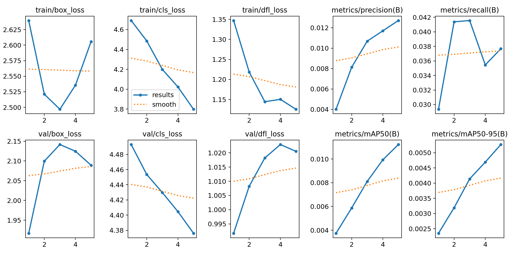
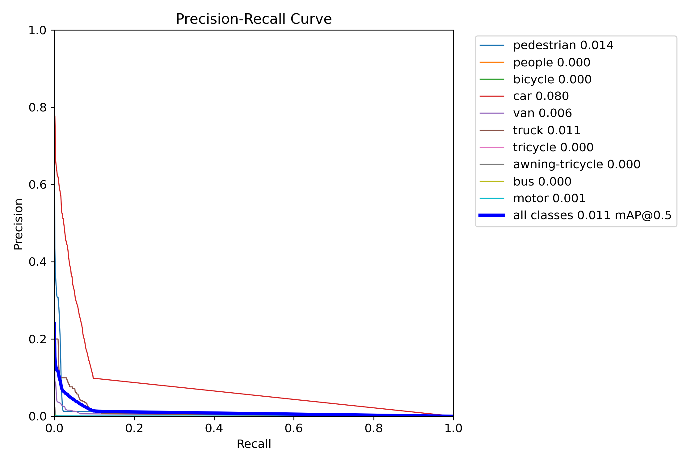
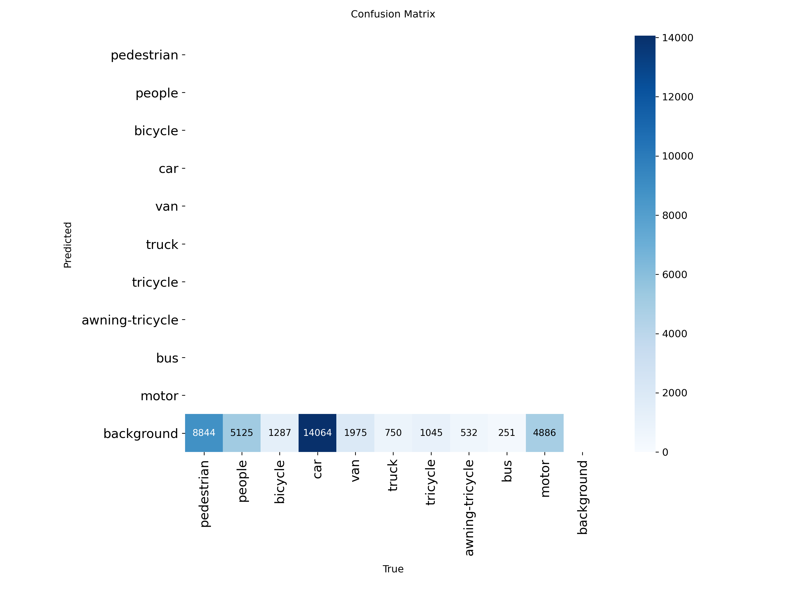
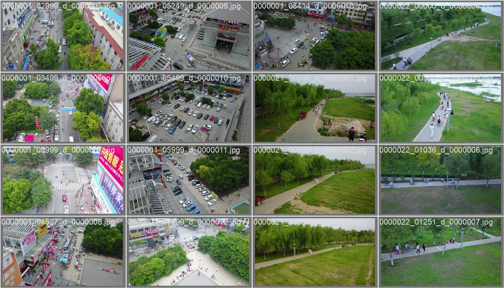
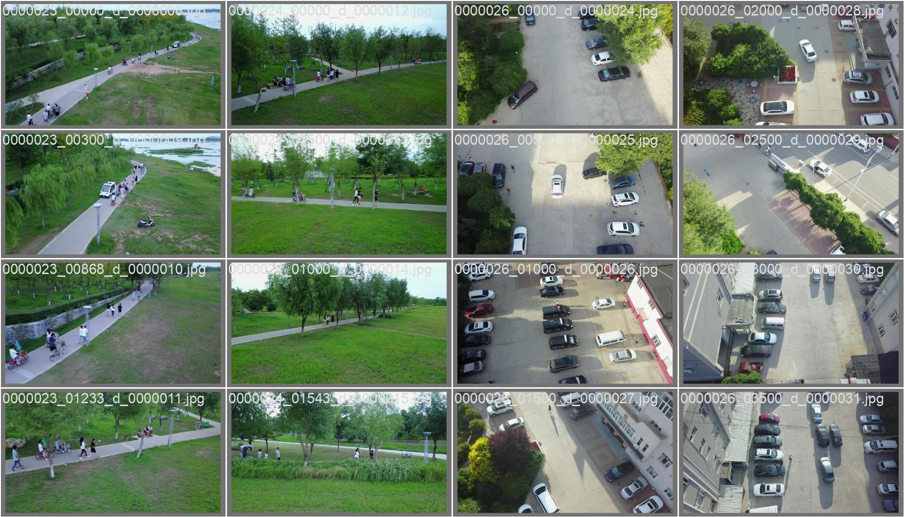
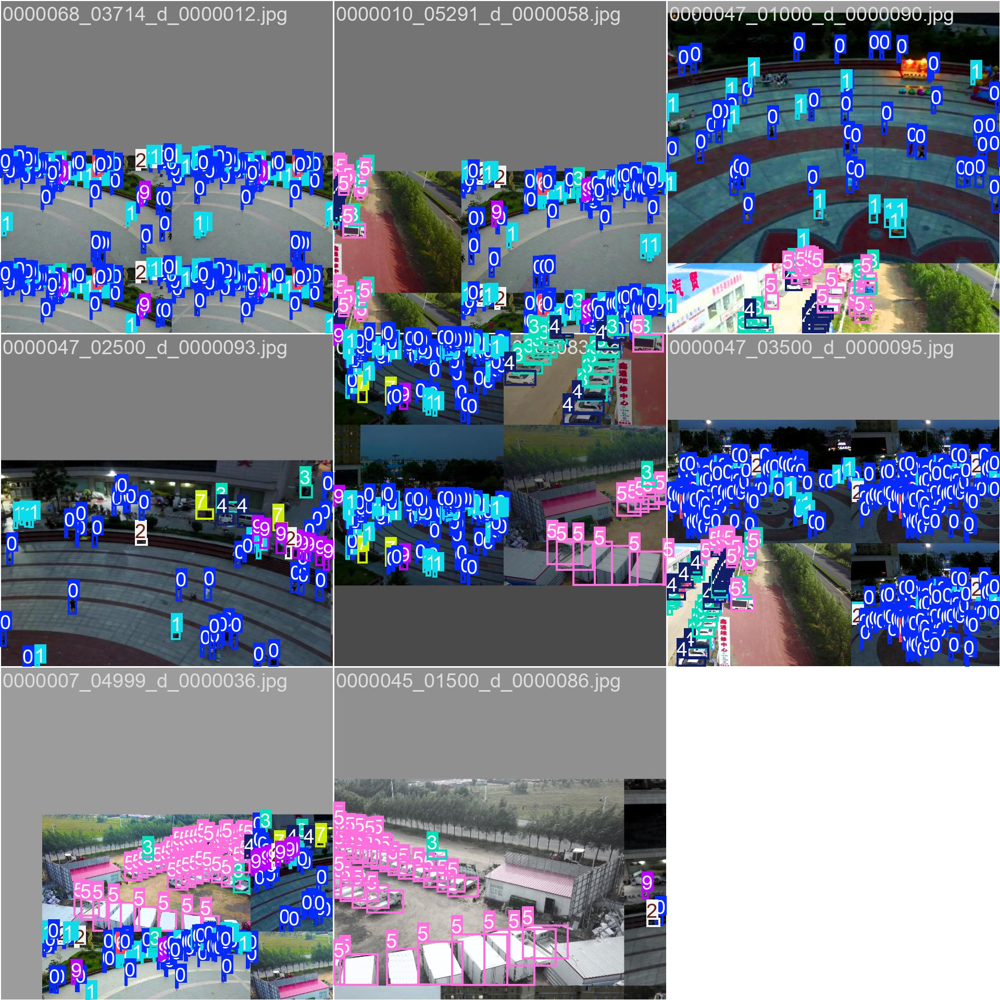

# FlowTrack Model Report

## 1) Training Run Summary
- Run name: `visdrone_smoke5`
- Framework: Ultralytics YOLOv8
- Backbone/init: `yolov8n.pt`
- Dataset: `VisDrone.yaml`
- Train profile: 5 epochs, fraction=1%, imgsz=640, batch=8, CPU
- Weights selected: `runs/detect/runs/flowtrack/visdrone_smoke5/weights/best.pt`
- Registered project model: `models/flowtrack_best.pt`
- ONNX export: `models/flowtrack_best.onnx`

## 2) Final Validation Metrics (best checkpoint)
Source: `runs/detect/runs/flowtrack/visdrone_smoke5/results.csv` (epoch 5)

- Precision (B): **0.01271**
- Recall (B): **0.03768**
- mAP50 (B): **0.01122**
- mAP50-95 (B): **0.00527**

## 3) Metric Progress by Epoch
| Epoch | Precision | Recall | mAP50 | mAP50-95 |
|---|---:|---:|---:|---:|
| 1 | 0.00401 | 0.02935 | 0.00374 | 0.00235 |
| 2 | 0.00813 | 0.04138 | 0.00587 | 0.00319 |
| 3 | 0.01069 | 0.04156 | 0.00811 | 0.00414 |
| 4 | 0.01170 | 0.03545 | 0.00993 | 0.00469 |
| 5 | 0.01271 | 0.03768 | 0.01122 | 0.00527 |

## 4) Visual Artifacts
### Training curves

### Precision-Recall curve

### Confusion matrix

### Validation predictions

### Sample training batch

## 5) Interpretation
- The model is valid as an end-to-end functional checkpoint.
- Metrics are low because this was intentionally a **quick smoke training** profile on CPU with only 1% of data.
- For deployment-grade accuracy, run full training profile and/or BDD100K + custom camera dataset fine-tuning.

## 6) Recommended Accuracy Upgrade Path
1. Train `configs/training/train_visdrone_full.yaml`.
2. Train/fine-tune on converted BDD100K (`configs/training/train_bdd100k.yaml`).
3. Add camera-specific samples and hard-negative scenes.
4. Benchmark class-level AP for `car`, `truck`, `bus`, `person` before production rollout.
